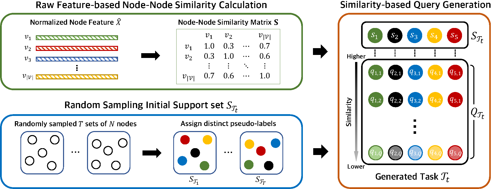
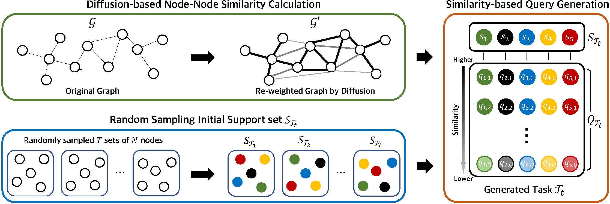

# Unsupervised Episode Generation for Graph Meta-learning
The source code of the unsupervised episode generation method called **Neighbors as Queries (NaQ)** from the paper "[Unsupervised Episode Generation for Graph Meta-learning](https://arxiv.org/abs/2306.15217)"  
(_This paper will be presented in ICML 2024._)

<p align="center">   
    <a href="https://pytorch.org/" alt="PyTorch">
      </a>
    <a href="https://icml.cc/" alt="Conference">
        </a>
</p>

## Overview
By generating training episodes in an unsupervised manner, our NaQ enables **unsupervised Graoh Meta-learning** via unsupervised training of existing graph meta-learning methods.
To check further details, please refer to the [slide](https://dsail.kaist.ac.kr/files/ICML24_NaQ_slide.pdf) or provided arXiv link (_the contents in the arXiv will be updated soon._)

### 1. NaQ-Feat
NaQ-Feat generates query set by sampling raw-feature level similar nodes for each randomly sampled support set nodes in the entire graph.
<p align="center"></p>

### 2. NaQ-Diff
NaQ-Diff generates query set by sampling structurally similar nodes found via [graph Diffusion](https://arxiv.org/abs/1911.05485) for each randomly sampled support set nodes in the entire graph.
<p align="center"></p>

## Abstract
We propose Unsupervised Episode Generation method called **Neighbors as Queries (NaQ)** to solve the Few-Shot Node-Classification (FSNC) task by _unsupervised Graph Meta-learning_.
Doing so enables full utilization of the information of all nodes in a graph, which is not possible in current supervised meta-learning methods for FSNC due to the label-scarcity problem.
In addition, unlike unsupervised Graph Contrastive Learning (GCL) methods that overlook the downstream task to be solved at the training phase resulting in vulnerability to class imbalance of a graph, we adopt the episodic learning framework that allows the model to be aware of the downstream task format, i.e., FSNC.
The proposed NaQ is a simple but effective _unsupervised_ episode generation method that randomly samples nodes from a graph to make a support set, followed by similarity-based sampling of nodes to make the corresponding query set.
Since NaQ is _model-agnostic_, any existing supervised graph meta-learning methods can be trained in an unsupervised manner, while not sacrificing much of their performance or sometimes even improving them.
Extensive experimental results demonstrate the effectiveness of our proposed unsupervised episode generation method for graph meta-learning towards the FSNC task.

## How to check implementations?
To check implementations of NaQ, please see task_generator.py method .query_generation_NaQ().

## How to Run?
To run our methods with ProtoNet (e.g. in Amazon-Clothing, 5-way 1-shot)
```bash
# NaQ-Feat
python unsup_protonet.py --dataset Amazon_clothing --n_way 5 --k_shot_test 1 --query_generation NaQ --type feature --lr 1e-4
# NaQ-Diff
python unsup_protonet.py --dataset Amazon_clothing --n_way 5 --k_shot_test 1 --query_generation NaQ --type diffusion --lr 1e-4
```

## Requirements
python=3.8.13  
pytorch=1.11.0  
scikit-learn=1.1.1  
numpy=1.21.5  
scipy=1.5.3  
pyg=2.0.4 (torch-geometric)  
